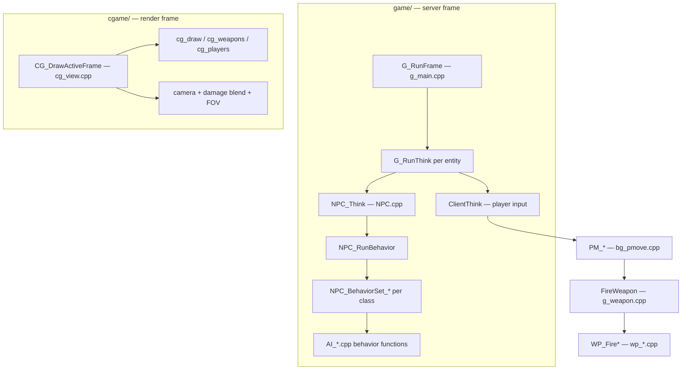
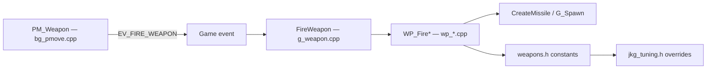

# JK2 Single-Player + JKGunplay Architecture Map

Reference for navigating this fork of OpenJK (JK2 SP). Use this before grepping blindly.

**Fork intent:** stay mergeable with `JACoders/OpenJK` while layering custom gameplay in separate files, gated by runtime cvars.

---

## Repository layout

```
JediKnight-Gunplay/
├── codeJK2/                 ← JK2 SP gameplay (this fork's main work)
│   ├── game/                Server-side logic (AI, weapons, damage, pmove)
│   ├── cgame/               Client prediction + rendering (HUD, view, FX)
│   ├── icarus/              Script/task system (ICARUS)
│   └── win32/               DLL resources
├── code/                    JKA SP shared bits (qcommon, ghoul2, client vm)
├── codemp/                  Multiplayer (largely untouched in JKG work)
├── shared/                  Cross-project headers
└── docs/                    Project documentation (this file)
```

**Single binary:** CMake target **JK2 SP Game Library** links `game/` + `cgame/` + `ui/` + `icarus/` into one DLL. Game and cgame share symbols (e.g. `cvar_t *g_jkg*` defined in game, referenced in cgame).

---

## Frame loop (where code runs)



| Question | Start here |
|----------|------------|
| Per-frame game tick | `g_main.cpp` → `G_RunFrame` |
| Player movement / weapon cadence | `bg_pmove.cpp` → `PM_Weapon`, `Pmove` |
| NPC AI tick | `NPC.cpp` → `NPC_Think` → `NPC_RunBehavior` |
| Weapon actually firing | `g_weapon.cpp` → `FireWeapon` → `wp_*.cpp` |
| Damage / armor / pain | `g_combat.cpp` |
| HUD / view / camera FX | `cgame/cg_draw.cpp`, `cg_view.cpp`, `cg_camera.cpp` |
| Console / cvars | `g_main.cpp` → `G_InitCvars` |

---

## NPC / AI architecture (stock Raven)

### Globals (critical for reading AI code)

Most `AI_*.cpp` files assume these are set:

- `NPC` — current `gentity_t*`
- `NPCInfo` — `NPC->NPC` extended AI state
- `ucmd` — synthesized usercmd for the NPC
- `level`, `navigator` — world + pathfinding

Set via `SetNPCGlobals(self)` at the start of `NPC_Think`.

### Dispatch chain

```
NPC_Think (NPC.cpp)
  └─ NPC_RunBehavior(playerTeam, bState)     ← best single hook point for a future AI router
       ├─ weapon/class early outs (emplaced, jedi, ATST, probe, sentry, …)
       └─ switch (NPC_class) → NPC_BehaviorSet_<Class>(bState)
            └─ switch (bState) → NPC_BS*_Default / Investigate / Sleep / …
                 └─ implemented in AI_<Class>.cpp
```

### Behavior states (`bState`)

Common values (see `bstate.h` / `dmstates.h`):

| State | Typical use |
|-------|-------------|
| `BS_DEFAULT` | Combat / general |
| `BS_PATROL` | Walking routes |
| `BS_INVESTIGATE` | Alert / search |
| `BS_SLEEP` | Idle guard |
| `BS_HUNT_AND_KILL` | Aggressive pursuit |
| `BS_CINEMATIC` | Script-driven |

### AI file map (by NPC type)

| File | Class / role | Main entry |
|------|--------------|------------|
| `AI_Stormtrooper.cpp` | Stormtrooper, swamptrooper, workers | `NPC_BSST_Default`, `Investigate`, `Sleep` |
| `AI_ImperialProbe.cpp` | Probe droid | `NPC_BSImperialProbe_Default` |
| `AI_Sentry.cpp` | Sentry | `NPC_BSSentry_Default` |
| `AI_Jedi.cpp` | Jedi / reborn | saber behavior |
| `AI_Default.cpp` | Generic fallback | `NPC_BSDefault` |
| `AI_Utils.cpp` | Shared helpers | aim, visibility, movement |
| `NPC.cpp` | Dispatch + think | `NPC_RunBehavior`, all `NPC_BehaviorSet_*` |
| `NPC_combat.cpp` | Combat helpers | shooting, aim |
| `NPC_senses.cpp` | Hearing / sight | alert events |
| `NPC_reactions.cpp` | Pain / flinch | `NPC_Pain` |
| `NPC_spawn.cpp` | Spawn + stat setup | health scaling, weapons |
| `NPC_stats.cpp` | Difficulty tables | aim, reaction time |

### Stormtrooper internals (largest grunt AI)

Stock pattern in `AI_Stormtrooper.cpp`:

```
NPC_BSST_Default
  ├─ no enemy → NPC_BSST_Patrol
  └─ enemy    → NPC_BSST_Attack
       ├─ ST_Commander (squad coordination)
       ├─ ST_CheckMoveState / ST_CheckFireState
       └─ group AI (AIGroupInfo_t, navigator)
```

Defining feature: **squad-level coordination** layered on per-NPC logic. Same structural spaghetti in `AI_Stormtrooper_JKG.cpp` today (~2700 lines, `_JKG` suffix).

---

## Weapon pipeline



| Layer | Location | Notes |
|-------|----------|-------|
| Fire cadence / anims | `bg_pmove.cpp` `PM_Weapon` | When player *can* fire |
| Dispatch | `g_weapon.cpp` `FireWeapon` | Switch on `ent->s.weapon` |
| Per-weapon logic | `wp_<name>.cpp` | Spawns projectiles, damage |
| Numeric tuning | `weapons.h` + `jkg_tuning.h` | `#define` constants |
| Declarations | `w_local.h` | e.g. `WP_LobFire` defaults |

---

## Player movement

| Concern | File | Key symbols |
|---------|------|-------------|
| Pmove core | `bg_pmove.cpp` | `Pmove`, `PM_*` |
| Movement constants | `bg_public.h`, cvars | `JUMP_VELOCITY`, `pm_friction`, `g_speed` |
| Applied speed | `g_active.cpp` | sets `client->ps.speed` |
| Torso / leg yaw (visual) | `cgame/cg_players.cpp` | `CG_G2PlayerAngles`, `CG_PlayerLegsYawFromMovement` |

### Third-person torso / legs yaw (cgame)

Client-only presentation: upper body follows the camera while legs lag, then catch up when the offset exceeds a threshold.

**G2 path (humanoid player, third person):** `CG_G2PlayerAngles` → `CG_PlayerLegsYawFromMovement` (leg lag + snap) + `CG_G2ClientSpineAngles` (splits view-vs-legs delta across spine bones). This is what you see on the local player.

**MD3 path (legacy segmented models / some NPCs):** `CG_PlayerAngles` → `CG_SwingAngles` with tolerances from `renderInfo` (head/torso yaw ranges in `NPC_stats.cpp` / `.npc` files).

| Knob | Mechanism | Tunable via |
|------|-----------|-------------|
| Turn amount before snap | `swingTolMin` / `swingTolMax` clamp in `CG_PlayerLegsYawFromMovement` | `cg_torsoYawMax` (default 80°), `cg_atstYawMax` (default 60°) |
| Snap speed | `maxTurnRate` caps per-frame leg rotation (half rate while moving) | `cg_torsoYawSnapSpeed` (default 6), `cg_atstYawSnapSpeed` (default 10) |

Cvars registered in `cgame/cg_main.cpp` (`CVAR_ARCHIVE`). NPC callers keep default `maxTurnRate`; only player G2 and `CG_ATSTLegsYaw` pass the cvars. Related but separate: `cg_swingSpeed` (MD3/NPC turn speed), `cg_turnAnims` (G2 hips turn anims).

---

## Combat / armor / stats

| Concern | File |
|---------|------|
| Damage application | `g_combat.cpp` — `G_Damage`, `CheckArmor` |
| Hit location modifiers | `g_combat.cpp` — `damageModifier[]` |
| Player pain | `g_combat.cpp` — `PlayerPain` |
| NPC pain | `NPC_reactions.cpp` — `NPC_Pain` |
| Armor pickups / clamp | `g_items.cpp`, `g_misc.cpp`, `bg_misc.cpp` |
| Stat indices | `statindex.h` — `STAT_HEALTH`, `STAT_ARMOR`, `STAT_MAX_ARMOR` |
| Script armor set | `Q3_Interface.cpp` |

---

## Cgame (client) vs game (server)

| Runs on | Directory | Examples |
|---------|-----------|----------|
| Server / authoritative | `game/` | AI, damage, spawning, `FireWeapon` |
| Client / presentation | `cgame/` | HUD, camera shake, view model, event sounds |
| Both read | `bg_public.h`, `bg_*.cpp` | `playerState_t`, pmove |

**Bridge:** game sends entity events (`EV_*` in `bg_public.h`); cgame handles them in `cg_event.cpp`. Example: `EV_PAIN_ARMOR` (JKG combat).

**JKG cvars:** declared in `jkg_local.h`, defined in `jkg_main.cpp`, used in both game and cgame via `JKG_*` macros.

---

## JKGunplay mod layer (current state)

### Cvars (all default `1`, `CVAR_ARCHIVE`)

| Cvar | Macro | Intended scope |
|------|-------|----------------|
| `g_jkgplay` | master | All subsystems off when `0` |
| `g_jkgAI` | `JKG_AI` | NPC AI |
| `g_jkgWeapons` | `JKG_WEAPONS` | Weapon fire + PM cadence |
| `g_jkgMovement` | `JKG_MOVEMENT` | Speed, jump, friction, torso yaw |
| `g_jkgArmor` | `JKG_ARMOR` | Separate max armor stat |
| `g_jkgCombat` | `JKG_COMBAT` | Damage table, pain timing |
| `g_jkgCamera` | `JKG_CAMERA` | Kickback + shake |
| `g_jkgHUD` | `JKG_HUD` | HUD / view tweaks |

Registration: `jkg_main.cpp` → `JKG_RegisterCvars()` called from `G_InitCvars()` in `g_main.cpp`.

### Integration patterns (what exists today)

**Pattern A — Dispatch hook (good for merges)**

Stock function starts with `if (JKG_*) { Custom(); return; }` then unchanged stock body.

Examples: `NPC_BehaviorSet_Stormtrooper`, `WP_FireBlaster`, `WP_FireThermalDetonator`.

**Pattern B — Inline guard / ternary (bad for merges)**

`value = JKG_X ? custom : stock` scattered in stock files (~55 sites across 21 files).

Examples: `AI_Sentry.cpp`, `bg_pmove.cpp`, `g_combat.cpp`, `cg_view.cpp`.

**Pattern C — Compile-time tuning (always on)**

`weapons.h` includes `jkg_tuning.h` at end — overrides `#define`s regardless of `g_jkgWeapons`.

### JKG source files (must be in CMake / VS project)

```
game/jkg_main.cpp
game/jkg_local.h
game/jkg_tuning.h
game/AI_Stormtrooper_JKG.cpp
game/wp_*_JKG.cpp  (bryar, blaster, repeater, bowcaster, thermal)
```

Listed in `codeJK2/game/CMakeLists.txt`.

### AI layer — current vs intended

| Area | Current | Intended (planned refactor) |
|------|---------|----------------------------|
| Stormtrooper | `AI_Stormtrooper_JKG.cpp` via hook in `NPC.cpp` | Keep, refactor internals in `jkg_ai/` |
| Investigate / Sleep | JKG file has `_JKG` versions but dispatcher still calls **stock** | Wire JKG paths or unified state machine |
| Probe / Sentry | Inline `JKG_AI` in stock `AI_*.cpp` | Move to `jkg_ai_probe.cpp`, `jkg_ai_sentry.cpp` |
| Pain / spawn | Inline guards in `NPC_reactions.cpp`, `NPC_spawn.cpp` | `JKG_AI_OnPain`, `JKG_AI_OnSpawn` in router |
| Stock AI files | Partially pristine | Fully pristine; **one hook** in `NPC_RunBehavior` |

---

## “Where do I look?” quick index

| I want to change… | Primary files |
|-------------------|---------------|
| Stormtrooper combat / squads | `AI_Stormtrooper_JKG.cpp` (JKG) or `AI_Stormtrooper.cpp` (stock) |
| Which AI runs for a class | `NPC.cpp` → `NPC_RunBehavior` → `NPC_BehaviorSet_*` |
| NPC pain / flinch | `NPC_reactions.cpp` (+ JKG guards today) |
| NPC spawn health / weapons | `NPC_spawn.cpp`, `NPC_stats.cpp` |
| Probe / sentry behavior | `AI_ImperialProbe.cpp`, `AI_Sentry.cpp` |
| Weapon damage numbers | `jkg_tuning.h` (compile-time) or `weapons.h` (stock) |
| Weapon fire behavior | `wp_*_JKG.cpp` + hook in `wp_*.cpp` |
| Fire rate / weapon anims | `bg_pmove.cpp` `PM_Weapon` |
| Player run speed / jump | `g_active.cpp`, `bg_pmove.cpp`, `g_main.cpp` (`g_speed`) |
| Third-person torso/legs turn | `cg_players.cpp` — `CG_G2PlayerAngles`, `CG_PlayerLegsYawFromMovement`; cvars `cg_torsoYawMax`, `cg_torsoYawSnapSpeed` |
| ATST leg turn (piloting) | `cg_players.cpp` — `CG_ATSTLegsYaw`; cvars `cg_atstYawMax`, `cg_atstYawSnapSpeed` |
| Armor cap | `g_client.cpp`, `JKG_PS_MAX_ARMOR` in `jkg_local.h` |
| Damage / headshots | `g_combat.cpp` `damageModifier` / `jkg_damageModifier` |
| Camera recoil | `cg_camera.cpp` `CGCam_Kickback`, `wp_*_JKG.cpp` callers |
| HUD charge bar | `cg_draw.cpp` `CG_DrawWeaponCharge` |
| Toggle mod features | `jkg_main.cpp`, `jkg_local.h` |

---

## Merge / upstream workflow

- **Remote:** `upstream` → `JACoders/OpenJK`
- **Goal:** stock files differ from upstream only at small `JKG HOOK` blocks (or zero diff when `g_jkg*` off and hooks fall through to stock).
- **High conflict risk today:** any file with Pattern B inline guards.
- **Low conflict risk:** `*_JKG.cpp`, `jkg_*.cpp/h`, hook-only stock files.

When pulling upstream AI changes: merge stock `AI_*.cpp` cleanly, then reconcile your `*_JKG.cpp` or future `jkg_ai/` module — not scattered if-blocks.

---

## Known gaps / tech debt

1. **Incomplete stormtrooper dispatch** — `NPC_BehaviorSet_Stormtrooper_JKG` calls stock investigate/sleep.
2. **AI not in one place** — probe/sentry/pain/spawn still edited in stock files.
3. **`jkg_tuning.h` not gated** — weapon numbers always JKG values at compile time.
4. **JKG stormtrooper file** — relocated spaghetti, not redesigned architecture.
5. **Legacy duplicates** — `AI_StormtrooperNew.cpp`, `AI_Stormtrooper - Copy.cpp` may still exist locally; not part of the layer.

---

## Related docs

- `docs/save games.md` — save system
- `docs/renderer-architecture.md` — renderer (separate from gameplay)
