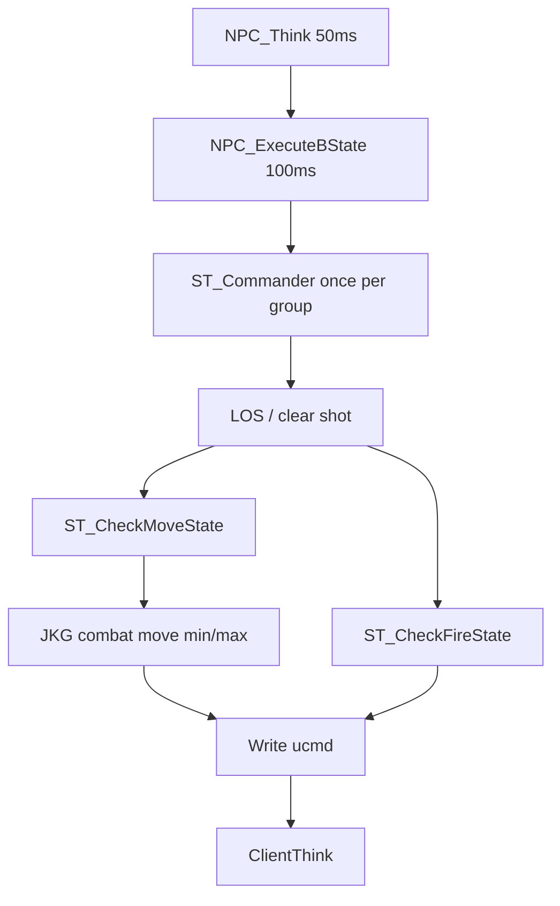
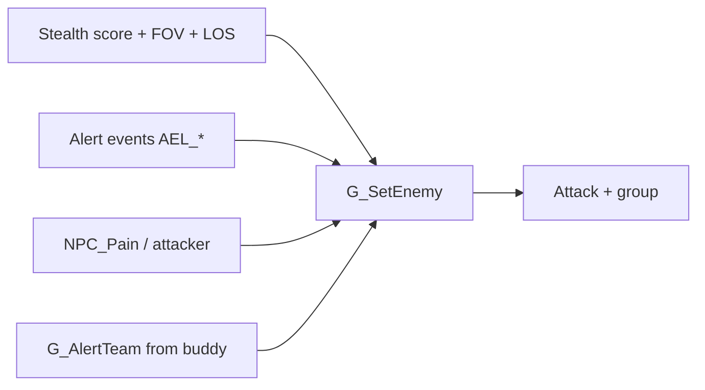

# JK2 SP — NPC AI architecture (stock + JKG)

Reference for **gun-NPC** behavior (stormtroopers and similar). Jedi, snipers, grenadiers, probes, and sentries use other `AI_*.cpp` modules.

**Parent map:** [jk2-jkgunplay-architecture.md](jk2-jkgunplay-architecture.md)

**Primary code (JKG on):** [`AI_Stormtrooper_JKG.cpp`](../codeJK2/game/AI_Stormtrooper_JKG.cpp), [`jkg_npc_combat_move.cpp`](../codeJK2/game/jkg_npc_combat_move.cpp), [`jkg_npc_combat_class.cpp`](../codeJK2/game/jkg_npc_combat_class.cpp), [`AI_Utils.cpp`](../codeJK2/game/AI_Utils.cpp), [`NPC_combat.cpp`](../codeJK2/game/NPC_combat.cpp) (`NPC_FindCombatPoint`), [`NPC_senses.cpp`](../codeJK2/game/NPC_senses.cpp), [`g_combat.cpp`](../codeJK2/game/g_combat.cpp) (`G_AlertTeam`).

---

## Think loop: movement and shooting are separate

NPCs synthesize a fake `usercmd_t` each **100 ms** bState tick (`NPC_ExecuteBState` in `NPC.cpp`). **Feet** and **trigger** are independent flags (`AImove`, `shoot`), then `ClientThink` runs pmove and weapon fire separately.



**Coupling:** if moving away without facing the enemy (`!faceEnemy && AImove`), `shoot` is forced off (no run-and-gun).

**`squadState`** gates movement (plant vs run). **LOS / `NPC_ShotEntity`** gates shooting. With **`g_jkgCombatMove`**, `JKG_ST_CombatMoveThink` overwrites commander combat-point goals with a min/max range step.

---

## No single “alert level” on the NPC

There is **no** `ALERT_COMBAT` enum on `gNPC_t`. Awareness is:

| Field / system | Role |
|----------------|------|
| `enemy` | Who I fight (`NULL` = not in combat) |
| `enemyLastSeenTime` / `enemyLastSeenLocation` | Last known position |
| `investigate*` / `tempBehavior == BS_INVESTIGATE` | Heard/saw something, not full combat |
| `squadState` | **Combat role** (stand, run to CP, scout), not awareness |
| `level.alertEvents[]` + `AEL_*` | Short-lived world events (minor → danger great) |

Stormtroopers often **keep** `enemy` once acquired (give-up paths largely disabled in stock ST attack).

---

## How NPCs become aware (four doors)

All combat entry paths eventually call **`G_SetEnemy`** (stores enemy, bad first aim, attack delay, **`G_AngerAlert`**).



### Sight (patrol)

`NPC_CheckEnemyStealth` / `_JKG`: distance, FOV, LOS, light/speed/crouch score. Thresholds ~0.6 realize, ~0.45 cautious then delay. Defaults: visrange 1024, hfov 90, vfov 60 (`NPC_stats.cpp` / NPCs.cfg). Requires `SCF_LOOK_FOR_ENEMIES`.

### Sound / sight events

`AddSoundEvent` / `AddSightEvent` → pool of 32, ~200 ms lifetime. `AEL_DISCOVERED` with enemy-team owner → `G_SetEnemy(owner)`. Lesser levels → look or walk to investigate (`BS_INVESTIGATE`) if `SCF_CHASE_ENEMIES`.

### Being shot

`NPC_Pain` → `NPC_CheckAttacker` → may `G_SetEnemy`. First anger runs **`G_AngerAlert`** (not pain itself).

### “Squad wake” (contagion, not tactics)

**`client->squadname` is unused** (legacy). Wake-up is **`G_AlertTeam`** when someone first gets mad or dies:

- Radius **512** (anger sound **256**)
- Same team, `SCF_LOOK_FOR_ENEMIES`, not `SCF_NO_GROUPS` / `SCF_IGNORE_ALERTS`
- Target must have **no enemy yet**
- Hear victim or **see** victim (FOV + LOS)
- Sets **`G_SetEnemy(teammate, attacker)`** — enemy pointer only, not last-seen pos

Commander loop that would `G_SetEnemy` every idle group member is **commented out**.

**Script gates:** `SCF_LOOK_FOR_ENEMIES`, `SCF_IGNORE_ALERTS`, `SCF_CHASE_ENEMIES`, `SCF_NO_GROUPS`.

---

## Groups vs “squads” (design vs logic)

### Design intent

- Aggro spreads to nearby allies.
- Not everyone charges at once (runner vs planters).
- One scout to last-seen if LOS lost.
- Shared “mood” (morale) from enemy weapon/health/deaths.
- Officers feel like they hang back (speech + CP flags when Imperial commander rank).

### Logic (two systems)

**1. Contagion** — `G_AlertTeam` / `G_AngerAlert` / `G_DeathAlert`. Copies **who to hate**. Not a persistent unit.

**2. Combat clipboard** — `AI_GetGroup` **rebuilt each frame** (max 32 groups, 31 members):

- Same team, gun-NPC types only (no Jedi/sniper/droid/ATST/etc.)
- Same `enemy`, or no enemy but in PVS of group enemy; patrol clumps within **384** of commander
- Dropped if no `enemyLastSeenTime` update for **7 s**; dissolved after **3 min** no group LOS → search

`group->commander` = highest **`rank`** (morale weight + Imperial hang-back when **that** member is processed). **Not** the sole thinker.

**Shared:** enemy, `enemyLastSeenPos`, `lastSeenEnemyTime`, `lastClearShotTime`, morale, `numState[squadState]`.

**Per member (set in commander pass):** `goalEntity`, `combatPoint`, `squadState`, timers (`roamTime`, `stick`, `duck`, `flee`).

**Light coordination:** if anyone is `SCOUT` / `TRANSITION` / `RETREAT`, others often **stay and shoot**; covering fire at last seen; one scout when group hasn’t seen enemy **10 s**; `ST_TransferMoveGoal` on blocker.

---

## `ST_Commander` — batch assignment, not one order

**Misleading name:** `ST_Commander_JKG()` is a **group tactical pass**, not “the officer NPC orders the squad.”

- First group member to run attack each frame with `!group->processed` calls it; sets `processed = true`.
- **Loops every angry member** (`SetNPCGlobals(member)`), picks **each member’s own** combat point via `NPC_FindCombatPoint` from **that member’s origin**.
- Members do **not** independently search in their own attack think; they **execute** goals assigned here.

`d_asynchronousGroupAI`: only one member processed per commander call (round-robin).

---

## Squad states (`SQUAD_*` in `ai.h`)

Combat **roles** (feet), not awareness:

| State | Typical behavior |
|-------|------------------|
| `SQUAD_IDLE` | No movement job |
| `SQUAD_STAND_AND_SHOOT` | Planted, fire if clear shot |
| `SQUAD_COVER` | At hidden point, hold (often after retreat arrival) |
| `SQUAD_POINT` | On CP, duck/suppress until `stick` expires |
| `SQUAD_TRANSITION` | **Running to a combat point** (most common “reposition”) |
| `SQUAD_SCOUT` | Chase last-seen or approach enemy (may use CP or `goalEntity = enemy`) |
| `SQUAD_RETREAT` | Flee CP / `NPC_StartFlee` |

Arrival: `TRANSITION` → usually `STAND_AND_SHOOT`; `RETREAT` → `COVER` + duck/hide timers.

**Debug marker** (`g_jkgDebugNpcState`, requires `sv_cheats 1`): colors map to idle/investigate/squad states — see `jkg_npc_state_debug.cpp`.

---

## JKG generic combat move (no combat points)

When **`g_jkgCombatMove`** is **1** (default), stormtrooper JKG attack **does not use `point_combat`**. The commander skips `NPC_FindCombatPoint`. Positioning is calculated each attack tick in [`jkg_npc_combat_move.cpp`](../codeJK2/game/jkg_npc_combat_move.cpp) (`JKG_ST_CombatMoveThink`). Combat points remain in the map for later (cover/flank); they are unused while this is on.

`g_jkgNoCombatPoints 1` (cheat) also skips CP picks if combat-move is off.

### Loop (visible enemy)

There is **no mid “ideal” range**. The window is **min–max** only. They stop as soon as they are inside that window (often near **max** when approaching).

| Condition | Behavior |
|-----------|----------|
| No LOS | Nav to last-known; if already there (or for `huntCheatMs` after losing sight) path toward the live enemy. Then plant when they can see again. |
| Dist **&lt; min** | Wait **`moveDelay`** ms, then back up until dist ≥ min. Face and shoot while backing if they still have LOS. |
| Dist **&gt; max** | Wait **`moveDelay`**, then close until dist ≤ max (or nav-hunt the enemy if the step is blocked). |
| **min ≤ dist ≤ max** | Plant: stand and fire; occasional walking **strafe**. No continuous drift. |

`moveDelay` does not re-arm while they are already closing or backing; it resets when they re-enter the window or the condition ends.

Scripted nav (`TID_MOVE_NAV`), `SCF_CHASE_ENEMIES` off, flee timer, or no weapon skip this mover.

### Combat classes

Numbers are **not** per individual NPC. Each **NPC type** in `ext_data/NPCs.cfg` can set:

```
stormtrooper
{
	...
	combatClass	rifle
}
```

Parsed in [`NPC_stats.cpp`](../codeJK2/game/NPC_stats.cpp) into `gNPC_t::jkgCombatClass`. Omitted or unknown name → class **`default`**.

Class definitions: **`ext_data/jkg_combat_classes.cfg`** (loaded at `NPC_LoadParms` via [`JKG_LoadCombatClasses`](../codeJK2/game/jkg_npc_combat_class.cpp)).

Copy the template from the repo:

`codeJK2/base/ext_data/jkg_combat_classes.cfg` → `<gamedata>/base/ext_data/jkg_combat_classes.cfg`

Shipped blocks: **`default`** (empty), **`rifle`**, **`pistol`**, **`officer`**.

**Resolve rule:** if a class sets a key, that value is used; if the key is omitted, the matching **`g_jkgCombat*` cvar is read live** (console works without a map restart for `default` and for any unset key).

| Class key | Cvar fallback | Default | Meaning |
|-----------|---------------|---------|---------|
| `idealRangeMin` / `rangeMin` | `g_jkgCombatIdealRangeMin` | 192 | Too-close line (back up) |
| `idealRangeMax` / `rangeMax` | `g_jkgCombatIdealRangeMax` | 320 | Too-far line (close in) |
| `rangeBand` | `g_jkgCombatRangeBand` | 32 | Extra slack **only if min == max** |
| `moveDelay` | `g_jkgCombatMoveDelay` | 700 | ms wait before close or back-up |
| `stepDist` | `g_jkgCombatStepDist` | 80 | Max length of one close/back-up step |
| `strafeDist` | `g_jkgCombatStrafeDist` | 64 | Side shuffle distance |
| `strafeTime` | `g_jkgCombatStrafeTime` | 900 | Shuffle burst (ms) |
| `strafePause` | `g_jkgCombatStrafePause` | 700 | Stand time between shuffles (ms) |
| `huntCheatMs` | `g_jkgCombatHuntCheatMs` | 2500 | After LOS loss, path to live player pos this long; then last-known. `0` = last-known only |

Master switches (not class keys): **`g_jkgCombatMove`**, **`g_jkgNoCombatPoints`**.

`g_jkgCombat` is **damage/pain**, not this mover.

Shipped class numbers (from the template cfg; omitted `moveDelay` uses the cvar):

| Class | min | max | Notes |
|-------|-----|-----|--------|
| `default` | cvar 192 | cvar 320 | Empty block — all live cvars |
| `rifle` | 256 | 400 | Typical E-11 trooper |
| `pistol` | 128 | 224 | Closer band |
| `officer` | 192 | 288 | Between rifle and pistol |

Savegames store `gNPC_t::jkgCombatClass[32]`. Older JKG saves without that field can fail to load.

---

## Combat points (`point_combat`)

**With `g_jkgCombatMove 1` (or `g_jkgNoCombatPoints 1`):** commander never calls `NPC_FindCombatPoint`. The rest of this section is stock CP behavior when those are off.

### Level design intent

Mapper-placed **`point_combat`** entities (`SP_point_combat` in `NPC_combat.cpp`):

- **Fight positions** — cover angles, chokepoints, duck/flee/investigate tags (`CPF_DUCK`, `CPF_FLEE`, `CPF_INVESTIGATE`, `CPF_SNIPE`, …).
- Linked to **nav waypoints** at map load (`CP_FindCombatPointWaypoints`).

Not generic patrol nodes; the AI treats them as **tactical anchors near the fight**.

### Runtime request flags (`CP_*` in `b_local.h`)

| Flag | Meaning |
|------|---------|
| `CP_COVER` | Enemy **cannot** LOS this point (hidden) |
| `CP_CLEAR` | From point, NPC can LOS enemy within `visrange` |
| `CP_NEAREST` | Shortest **nav path** from NPC |
| `CP_CLOSEST` | Prefer point **closest to enemy** (among survivors) |
| `CP_APPROACH_ENEMY` | Point closer to enemy than NPC is now |
| `CP_FLANK` | Point on **far side** of enemy from NPC (can be **behind player**) |
| `CP_RETREAT` / `CP_FLEE` | Farther / flee-tagged |
| `CP_HAS_ROUTE` | Must have nav route or clear path |
| `CP_AVOID_ENEMY` | Don’t run toward enemy along approach vector |

### Selection pool (why fights cluster on the player)

`NPC_CollectCombatPoints` uses **`enemyPosition`** (usually the player) and radius **`CP_COLLECT_RADIUS` (512)**. Only points near **the enemy** are candidates. Map density around the player dominates behavior.

If flags fail, requirements are **stripped in order** (investigate, duck, flank, cover, clear, …) until `CP_ANY`.

### Morale-driven mixes (`ST_GetCPFlags_JKG`)

- Low morale: hide (`CP_COVER`, no clear required).
- High morale: charge (`CP_CLEAR`, `CP_FLANK`, `CP_APPROACH_ENEMY`, `CP_CLOSEST`) — **no cover required**.
- Default mix: random among **CLEAR + COVER** + nearest / approach / closest / flank.

**Triggers for new CP / `SQUAD_TRANSITION`:** not on CP + `roamTime` done; shot (`LSTATE_UNDERFIRE`); can’t see enemy in PVS; no clear shot **5 s** (`ST_ApproachEnemy` → `CP_CLEAR | CP_CLOSEST`); lost enemy **10 s** (scout to `enemyLastSeenPos`).

### Why NPCs rush or run behind the player

Often **by design of the rules**, not random:

1. Candidate pool is always **within 512 of the player**.
2. `CP_CLOSEST` + `CP_APPROACH_ENEMY` = step **toward** the enemy’s shootable spot.
3. `CP_FLANK` = valid point **behind** the player relative to the trooper.
4. Relaxation drops `CP_COVER` → open ground near player still valid.
5. Scout / `ST_HuntEnemy` sets **`goalEntity = enemy`** if no CP.

**Tuning levers (stock):** combat point placement, `SCF_CHASE_ENEMIES`, `SCF_USE_CP_NEAREST`, morale (enemy weapon/health), map waypoint connectivity.

---

## Stormtrooper attack flow (summary)

```
NPC_BSST_Default_JKG
  no enemy → Patrol (stealth, alerts, investigate)
  enemy    → NPC_BSST_Attack_JKG
               AI_GetGroup
               if !group->processed → ST_Commander_JKG (assign per-member CP + squadState)
               LOS / ShotEntity → shoot flag
               ST_CheckMoveState_JKG / ST_CheckFireState_JKG
               JKG_ST_CombatMoveThink (min/max range if g_jkgCombatMove)
               ST_Move → NPC_MoveToGoal (combatMove)
               WeaponThink → ShootThink → JKG_NpcBurstShootThink if JKG_AI
```

**bState** (`BS_PATROL`, `BS_STAND_AND_SHOOT`, …) is mostly a **dispatcher label** for troopers; real fight posture is **`squadState`**, not `BS_STAND_AND_SHOOT`.

---

## JKG layer (AI)

| Area | Stock | JKG (`g_jkgAI` + `g_jkgplay`) |
|------|-------|-------------------------------|
| Group / senses / `G_AlertTeam` | Same | Same |
| Stormtrooper brain | `AI_Stormtrooper.cpp` | `AI_Stormtrooper_JKG.cpp` via `NPC_BehaviorSet_Stormtrooper` |
| Burst fire | Stock spacing | `jkg_npc_fire.cpp` |
| Locomotion execution | Snap | `jkg_npc_move.cpp`, `g_active.cpp` |
| Aim spread / pain | Stock | `jkg_npc_aim.cpp`, wider E-11 in `jkg_tuning.h` |
| State debug | — | `g_jkgDebugNpcState` + `jkg_npc_state_debug.cpp` (`G_DebugLine` markers) |
| No combat points | — | `g_jkgNoCombatPoints` and/or `g_jkgCombatMove` skip `ST_Commander_JKG` CP picks |
| Generic combat move | — | `g_jkgCombatMove` + `jkg_npc_combat_move.cpp` (min/max + delay) |
| Combat classes | — | `jkg_npc_combat_class.cpp`, `ext_data/jkg_combat_classes.cfg`, NPCs.cfg `combatClass` |

JKG combat-move **replaces** commander CP assignment while `g_jkgCombatMove` is on. Stock CP selection still exists when that cvar is 0.

---

## Key files quick index

| Topic | File |
|-------|------|
| Think / dispatch | `NPC.cpp` |
| Commander + attack | `AI_Stormtrooper_JKG.cpp` |
| Generic combat move | `jkg_npc_combat_move.cpp` |
| Combat classes | `jkg_npc_combat_class.cpp`, `NPC_stats.cpp` (`combatClass`) |
| Groups / morale | `AI_Utils.cpp` |
| Combat points | `NPC_combat.cpp` |
| Set enemy / anger | `NPC_combat.cpp`, `g_combat.cpp` |
| Senses / alerts | `NPC_senses.cpp` |
| Pain | `NPC_reactions.cpp` |
| Enums | `ai.h`, `bstate.h`, `g_local.h` (`AEL_*`), `b_local.h` (`CP_*`, `CPF_*`) |

---

## Debug visualization (nav nodes and combat points)

**Requires `sv_cheats 1`.**

### Stock console command: `nav`

Registered in [`g_svcmds.cpp`](../codeJK2/game/g_svcmds.cpp) (cheat). Toggles draw flags consumed each frame in [`NAV_ShowDebugInfo`](../codeJK2/game/g_nav.cpp) (`G_RunFrame`).

| Command | Effect |
|---------|--------|
| `nav show all` | Toggle nodes, edges, radius, combat points, enemy path, nav goals, collision |
| `nav show nodes` | Red sprites on nav graph nodes in PVS (~1024 units of player) |
| `nav show edges` | Lines between connected nodes |
| `nav show combatpoints` | Cyan sprites at each `point_combat` origin |
| `nav show enemypath` | Debug lines while NPCs macro-navigate |
| `nav show radius` | Node radii when near player |
| `nav show navgoals` | Script nav goal tags |
| `nav totals` | Print node count + combat point count |

Rendering uses cgame local entities / FX (`CG_DrawNode`, `CG_DrawCombatPoint` in [`cg_main.cpp`](../codeJK2/cgame/cg_main.cpp)).

---

## Known stock quirks (when debugging)

- Commander “morale much lower than squad size → flee” branches compare positive `moraleDrop` to negative thresholds — flee/retreat branches **never fire**; `morale < 0` hide still works.
- `AI_SortGroupByPathCostToEnemy` uses enemy waypoint for all members — “closest/farthest member” list slots are not true distance ranking.
- `closestBuddy` / “buddy tell friend to get mad” commander block is **commented out**; buddy finder never skips self.
- `CG_DrawAlert` exists but is **not called** from game AI (stealth debug unused).
